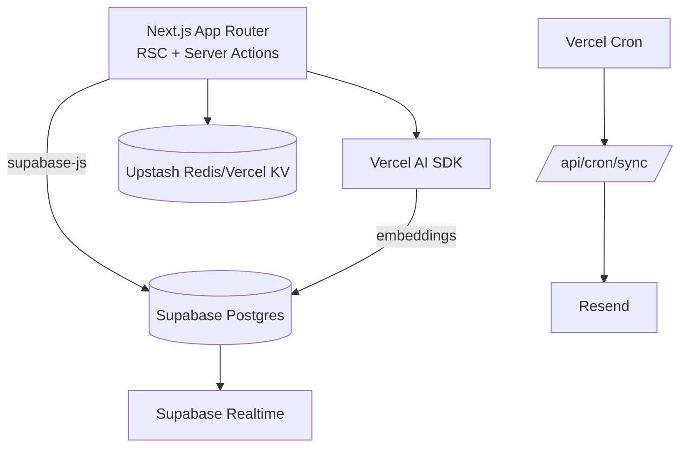

Recall — a unified second brain built with Next.js 16, Supabase, and the Vercel AI SDK.

## Architecture



## Getting Started

First, install deps and run the development server:

```bash
npm install
npm run dev
```

Open [http://localhost:3000](http://localhost:3000) with your browser to see the result.

You can start editing the page by modifying `app/page.tsx`. The page auto-updates as you edit the file.

### Environment
- Copy `.env.example` to `.env.local` and fill in:
  - NEXT_PUBLIC_SUPABASE_URL / NEXT_PUBLIC_SUPABASE_ANON_KEY
  - SUPABASE_SERVICE_ROLE_KEY (server-only)
  - OPENAI_API_KEY (or GROK/Anthropic)
  - RESEND_API_KEY, EMAIL_FROM
  - Optional: Upstash/Vercel KV

### Supabase
- Apply SQL in `supabase/migrations/20260303_initial.sql`
- In Supabase Auth, enable X (Twitter) provider and set callback to:
  - `${NEXT_PUBLIC_APP_URL}/auth/callback`

This project uses [`next/font`](https://nextjs.org/docs/app/building-your-application/optimizing/fonts) to automatically optimize and load [Geist](https://vercel.com/font), a new font family for Vercel.

## Deployment (Vercel)

- Set project root to `apps/recall-next`
- Add `vercel.json` to enable the 4h cron to `/api/cron/sync`
- Set env vars in Vercel dashboard
- Optional: Enable Sentry and Analytics

## Testing

```bash
npm run test
```

## Security

- Full RLS across all tables
- No service keys on the client
- Middleware guards protected routes

## Notes
- This app lives beside your existing Vite project without changing it.
